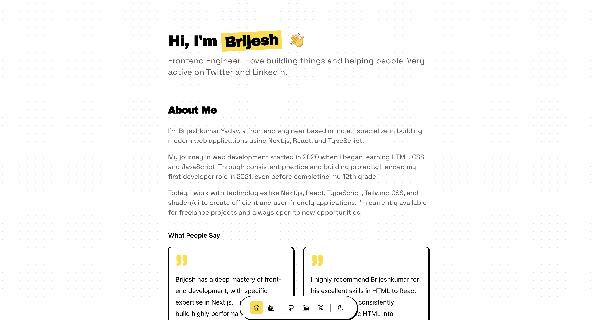

# Portfolio

A minimal, pixel-perfect dev portfolio, and blog to showcase my work as a Frontend Engineer.

## Features
- Clean & modern design
- Light & Dark theme support with system preference detection
- Blog built with MDX (Fumadocs)
- Dynamic OG images for blog posts
- SEO optimized (JSON-LD, sitemap, robots.txt)
- Vercel Analytics integration

## Tech Stack

- Next.js 16
- React 19
- TypeScript
- Tailwind CSS v4
- RetroUI
- Fumadocs

## Running the project

1. Clone the repository
2. Install dependencies `pnpm install`
3. Run the development server `pnpm dev`
4. Open `http://localhost:3000` in your browser

## License

Licensed under the [MIT license](https://github.com/brijeshmarch16/portfolio/blob/main/LICENSE).
